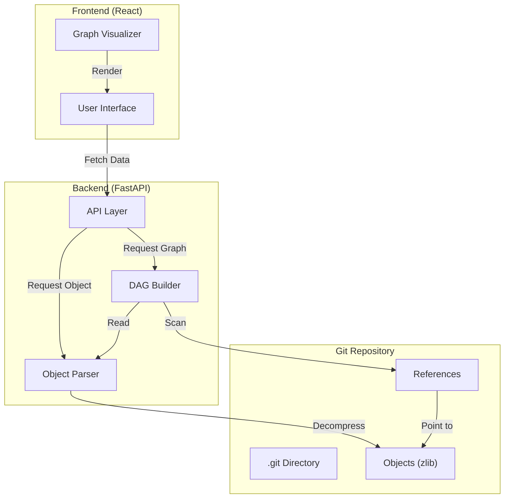

# tinygit (Git Graph Explorer)

**tinygit** is a lightweight tool to visualize and explore the internals of a Git repository. It bypasses the standard `git` CLI to interact directly with the `.git` directory, parsing binary objects (commits, trees, blobs) and constructing a Directed Acyclic Graph (DAG) for visualization.




## Why This Project?

I built **tinygit** to deeply understand the internals of Git. By implementing the core plumbing commands (hash-object, cat-file, etc.) and a custom parser in Python, I learned how Git stores data as a Directed Acyclic Graph (DAG). This project visualizes that graph, making the abstract concepts of Merkle trees and content-addressable storage concrete.

## Features

-   **Commit Graph Visualization**: React-based force-directed graph to see the history of your repository.
-   **Object Inspection**: Click on commits to see details and inspect tree structures/blob contents.
-   **Code-Level Git Implementation**: Pure Python implementation of Git object parsing (zlib decompression, SHA-1 hashing).
-   **Git Internals**: Learn about loose objects, packs, and refs.

## Tech Stack

-   **Backend**: Python 3.10+, FastAPI, Pytest
-   **Frontend**: React 19, Vite, Lucide React
-   **Infrastructure**: Docker & Docker Compose

## Quick Start (Local)

The easiest way to run the application is with **Docker**, which sets up both the frontend and backend automatically.

1.  **Clone the repository**:
    ```bash
    git clone https://github.com/alwaysvivek/tiny-git.git
    cd tiny-git
    ```

2.  **Run with Docker Compose**:
    ```bash
    docker compose up --build
    ```

3.  **Explore**:
    -   Open [http://localhost:8000](http://localhost:8000).
    -   You will see the commit graph of the internal `repos/playground` repository.
    -   Click on nodes to inspect commits, view trees, and read file contents.

## Manual Development

If you prefer to run the services individually without Docker:

1.  **Backend** (Python):
    ```bash
    pip install "fastapi[standard]" uvicorn
    # Set the target git repo (defaults to internal playground)
    export GIT_DIR=$(pwd)/repos/playground/.git
    uvicorn src.api.main:app --reload
    ```

2.  **Frontend** (React):
    ```bash
    cd src/ui
    npm install
    npm run dev
    ```

## Documentation

-   [Architecture Overview](docs/architecture.md)
-   [Internals Guide](docs/internals.md)

## Testing

To run the backend test suite:

```bash
pytest
```

## API Documentation

The backend provides a fully interactive API documentation (Swagger UI).

1.  Start the application (via Docker or locally).
2.  Open [http://localhost:8000/docs](http://localhost:8000/docs).

You can test endpoints directly from the browser:

-   `GET /api/graph`: Returns the nodes and edges for the visualization.
-   `GET /api/commits`: Lists the commit history.
-   `GET /api/blob/{oid}`: Returns the content of a file (blob).

